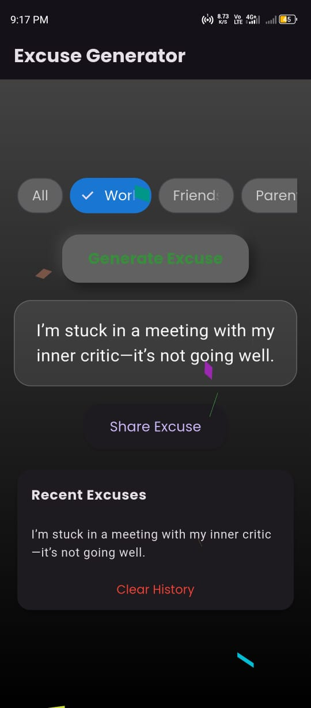

# Excuse Generator 🎉

**Excuse Generator – Random Excuse App**  
_Flutter · AdMob_  
A hilarious Flutter app that crafts absurd excuses to dodge any obligation with a smirk! Pick from categories like Work, Friends, Parents, School, or Dating, and enjoy a sleek Material 3 UI with neumorphic buttons, glassmorphic excuse displays, and confetti bursts. Share your favorite excuses, track recent ones, and monetize with AdMob banner ads. Perfect for a quick laugh or a creative escape! (MVP completed)  
_GitHub:_ [github.com/deepdarji/Excuse-Generator](https://github.com/deepdarji/Excuse-Generator)  
_Built by Deep Darji_

---

## ✨ Features

- 🎨 **Modern UI**: Material 3 design with neumorphism, glassmorphism, and gradient backgrounds for a premium look.
- 🏷️ **Categories**: Choose from Work, Friends, Parents, School, or Dating via scrollable ChoiceChips (no more cramped labels!).
- 😂 **Random Excuses**: Generate ridiculous excuses with confetti effects and smooth micro-animations.
- 📤 **Share Excuses**: Share your favorite excuses via the system share sheet.
- 📜 **History Tracking**: View and clear recent excuses in a stylish list.
- 📱 **Responsive Design**: Adapts to any screen size with system-based dark/light theme support.
- 💸 **AdMob Integration**: Banner ads at the bottom (test ID included, swap with your own for production).

## 📸 Screenshots

| Home Screen                     | Excuse Generated                |
| ------------------------------- | ------------------------------- |
|  |  |

## 🚀 Setup

1. **Clone the Repo**
   ```bash
   git clone https://github.com/deepdarji/Excuse-Generator.git
   ```
